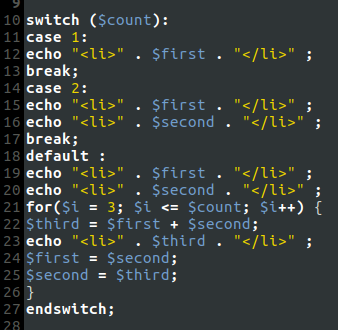
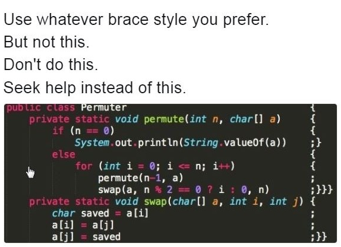

* TOC
{:toc}

<!-- ## TODO: Split this into Language specific files and move it into the language sections -->

## Grundlagen
Ein Styleguide beschreibt, wie bestimmte Elemente des Quellcodes zu gestalten sind. _Code Style Guides_ existieren für alle Sprachen und legen Aspekte wie die Art des Einrückens, die Verwendung von Klammern und Whitespace und die Schreibweise von Klassen- und Funktionsnamen fest.

Sich strikt an einen gemeinsamen Styleguide zu halten ist vor allem bei der Arbeit im Team besonders wichtig.

Hier zwei worst-case Beispiele:

Die Bezeichnungen der verschiedenen Klammern sind:
* ( ) - parenthesis (runde Klammern)
* [ ] - brackets (eckige Klammern)
* { } - braces (geschweifte Klammern)

## PHP
In den _PHP Standards Recommendations_ sind für einige Aspekte von PHP genaue Regeln definiert. So auch für den Code Style, welcher in [PSR-1](http://www.php-fig.org/psr/psr-1/) und [PSR-2](http://www.php-fig.org/psr/psr-2/) festgelegt ist.

Damit ihr euch nicht durch die kompletten Dokumente kämpfen müsst, seien hier die wichtigsten Regeln zusammengefasst. Wenn ihr versucht, euch an diese zu halten, ist euer Code bereits sehr gut lesbar.

In der folgenden Liste bedeutet ein vorangestelltes ©, dass sich die Regel nur auf Klassen und Objekte bezieht.

### PSR-1
* Files MUST use only <?php and <?= tags.
* Files MUST use only UTF-8 without BOM for PHP code.
* Files SHOULD either declare symbols (classes, functions, constants, etc.) or cause side-effects (e.g. generate output, change .ini settings, etc.) but SHOULD NOT do both.
* © Each class is in a file by itself.
* © Class names MUST be declared in CamelCase.
* © The term “class” refers to all classes, interfaces, and traits.
* © Class constants MUST be declared in all upper case with underscore separators.
* © Method names MUST be declared in studlyCase.

### PSR-2
* Code MUST use 4 spaces for indenting, not tabs.
* Line length soft limit MUST be 120 characters; lines SHOULD be 80 characters or less.
* There MUST NOT be trailing whitespace at the end of non-blank lines.
* There MUST NOT be more than one statement per line.
* Opening braces for classes and methods MUST go on the next line, and closing braces MUST go on the next line after the body.
* © Visibility MUST be declared on all properties and methods.
* © Property and method names SHOULD NOT be prefixed with a single underscore to indicate protected or private visibility.
* © The extends and implements keywords MUST be declared on the same line as the class name.
* © Abstract and final MUST be declared before the visibility.
* © Static MUST be declared after the visibility.
* Control structure keywords MUST have one space after them.
* Method and function calls MUST have NO space after them.
* Opening braces for control structures MUST go on the same line, and closing braces MUST go on the next line after the body.
* Opening parentheses for control structures MUST NOT have a space after them, and closing parentheses for control structures MUST NOT have a space before.
* PHP keywords MUST be in lower case.

### Ollo Addendum
* Variable names MUST be declared in snake_case.
* Function names MUST be declared in snake_case.
* © Property names MUST be declared in studlyCase.