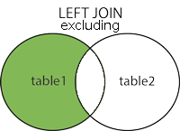
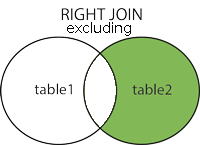
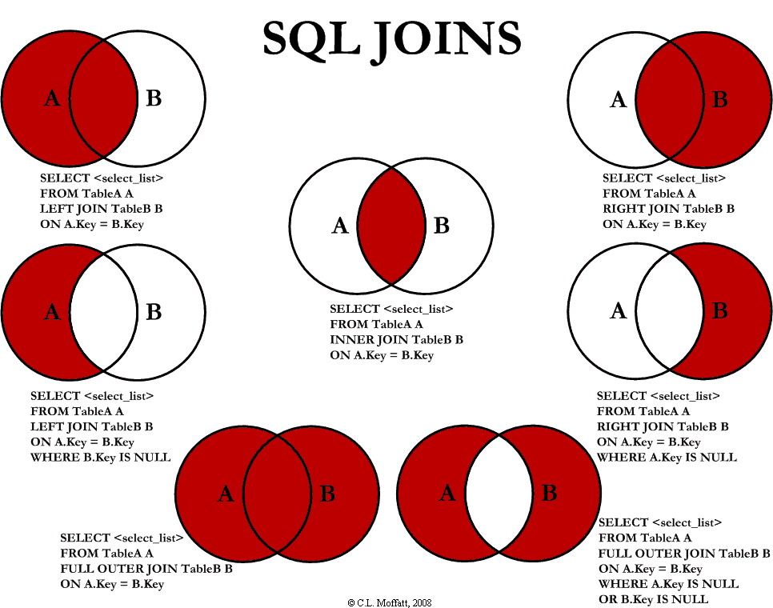

* TOC
{:toc}

## Grundlagen
Ein Datenbanksystem (DBS) ist ein System zur elektronischen Datenverwaltung. Die wesentliche Aufgabe eines DBS ist es, große Datenmengen effizient, widerspruchsfrei und dauerhaft zu speichern und benötigte Teilmengen in unterschiedlichen, bedarfsgerechten Darstellungsformen für Benutzer und Anwendungsprogramme bereitzustellen.

Ein DBS besteht aus zwei Teilen: der Verwaltungssoftware, genannt Datenbankmanagementsystem (DBMS) und der Menge der zu verwaltenden Daten, der Datenbank (DB) im engeren Sinn.

Ein DBMS stellt im Normalfall Funktionen zu Verfügung, um Daten zu definieren, erstellen, abzufragen, zu verändern und zu löschen. Außerdem erlaubt es, die Datenbank selbst zu administrieren (zB. Zugriffsrechte).

In unserem Fall kommt als DBMS MariaDB zum Einsatz, was ein relationales Datenbankmanagementsystem (RDBMS) ist.

Neben RDBMS gibt es aus sogenannte NoSQL-Datenbanken wie MongoDB, welche die Daten in einem JSON-ähnlichen Format speichern, und Graph-Datenbanken wie Neo4J, welche die Daten als Graph darstellen.

Eine Datenbank ist eine strukturierte Sammlung von Daten. Sie ist die Gesamtheit aus den Schemas, Tabellen, Anfragen (Query), Berichten (Report), Views (Ansichten) und anderen Objekten.
Die Strukturierung der Daten spiegelt meist Aspekte des reellen Lebens wieder, wie zB die freien Zimmer eines Hotels oder alle Mitarbeiter einer Firma.

Um eine Datenbank im Kontext des Internets einzusetzen, werden vier Dinge benötigt:
* Ein RDBMS Programm/Server (MariaDB, MS Access, SQL Server, MySQL)
* Eine serverseitige Programmiersprache (PHP, Python, ASP)
* Eine Sprache, um die gewünschten Daten abzufragen (SQL)
* Eine Möglichkeit, dem Benutzer die Daten anzuzeigen (HTML/CSS)

## RDBMS
Ein RDMBS speichert Objekte in sogenannten Relationen, oft einfach Tabellen (table) genannt, wobei eine Tabelle ein Sammlung von gleichartigen Daten ist. Eine Tabelle besteht aus Tupeln / Zeilen (record, row) und Attributen / Feldern / Spalten (column). Dies erzeugt eine Matrix aus einzelnen Datenfeldern oder Werten, in Tabellenkalkulationen oft Zellen genannt.

Um der vollständigen Verwirrung vorzubeugen, werde ich nur die Begriffe Zeile, Spalte und Zelle verwenden.

Die Interaktion mit der Datenbank erfolgt über sogenannte SQL Statements.

Fast alle Varianten von SQL unterstützen die folgenden Statements:
SELECT, UPDATE, DELETE, INSERT, WHERE

SQL Schlüsselwörter sind nicht case-sensitive, werden jedoch per Konvention in Großbuchstaben geschrieben.

Die wichtigsten Statements sind:
* SELECT - Daten aus der DB auslesen
* UPDATE - Daten in der DB verändern
* DELETE - Daten aus der DB löschen
* INSERT INTO - Daten in die DB einfügen
* CREATE DATABASE - Eine neue DB erstellen
* ALTER DATABASE - Die Struktur einer DB verändern
* CREATE TABLE - Eine neue Tabelle anlegen
* ALTER TABLE - Die Struktur einer Tabelle verändern
* DROP TABLE - Eine Tabelle löschen
* CREATE INDEX - Einen Suchindex (Search Key) erstellen
* DROP INDEX - Einen Suchindex löschen

## phpMyAdmin Workflow
[Screenshots](../assets/misc/phpmyadmin_workflow.zip)

## Anmerkung
Spaltennamen könnten Leerzeichen enthalten oder identisch zu SQL Schlüsselwörtern sein. Damit SQL diese korrekt interpretiert, müssen sie in Backticks (\`) gesetzt werden. Deshalb kann es sinnvoll sein, sich anzugewöhnen Tabellenspalten immer in Backticks (\`) zu setzen.

Zur Verbesserung der Lesbarkeit lasse ich die Backticks in der Dokumentation größtenteils weg.


## Datentypen
Aus Performance-Gründen ist es wichtig, für die Spalten einer Tabelle die korrekten Datentypen zu verwenden. Zum Beispiel sollte eine Spalte, in der immer nur zwei Zeichen gespeichert werden sollen, keine 10 Zeichen breit sein.

MySQL/MariaDB bietet eine Vielzahl von Datentypen, die sich in drei Kategorien einteilen lassen:

### Numerische Datentypen
* INT − Ein standard Integer, mit oder ohne Vorzeichen (signed/unsigned). Der signed Wertebereich ist -2.147.483.648 bis 2.147.483.647, unsigned 0 bisto 4.294.967.295. Ein Int kann bis zu 11 Ziffern breit sein.

* TINYINT − Ein sehr kleiner Integer. Signed von -128 bis 127. Unsigned von 0 bis 255. Breite bis zu 4 Ziffern.

* SMALLINT − Ein kleiner Integer. Signed von -32.768 bis 32.767. Unsigned von 0 bis 65.535. Breite bis zu 5 Ziffern.

* MEDIUMINT − Ein Integer mittlerer Größe. Signed von -8.388.608 bis 8.388.607. Unsigned von 0 bis 16.777.215. Breite bis zu 9 Ziffern.

* BIGINT − Ein großer Integer. Signed von -9,223,372,036,854,775,808 bis 9,223,372,036,854,775,807. Unsigned von 0 bis 18,446,744,073,709,551,615. Ein Bigint kann maximal 20 Ziffern breit sein.

* FLOAT(M,D) − Eine Fließkommazahl, die immer signed ist. Es können die Gesamtbreite der Darstellung (M) und die Anzahl der Dezimalstellen (D) angegeben werden. (Default ist 10,2). Die maximale Präzision ist 24 Stellen.

* DOUBLE(M,D) − Eine Fließkommazahl doppelter Präzision, die immer signed ist. Es können die Gesamtbreite der Darstellung (M) und die Anzahl der Dezimalstellen (D) angegeben werden. Default ist 16,4). Die maximale Präzision ist 53 Stellen.

* DECIMAL(M,D) − Eine nicht gepackte Fließkommazahl, die immer signed ist. Hier entspricht jeder Dezimalstelle ein Byte. Gesamtbreite (M) und Anzahl der Dezimalstellen (D) müssen angegeben werden. NUMERIC ist ein Synonym für DECIMAL.

### Datum und Zeit
* DATE − Ein Datum zwischen 1000-01-01 und 9999-12-31 im Format YYYY-MM-DD.

* DATETIME − Eine Datum und Zeitpunkt zwischen 1000-01-01 00:00:00 und 9999-12-31 23:59:59 im Format YYYY-MM-DD HH:MM:SS.

* TIMESTAMP − Ein Unix-Timestamp zwischen 1.1.1970 und irgendwann im Jahr 2037. Die Darstellung ist ähnlich der einer DATETIME, jedoch ohne Bindestriche: YYYYMMDDHHMMSS - 19731230153000.

* TIME − Ein Zeitpunkt im Format HH:MM:SS.

* YEAR(M) − Ein Jahr als ein Zahle mit zwei oder vier Ziffern. Bei einer Länge von 2 (YEAR(2)) liegt YEAR zwischen 1970 und 2069 (70 bis 69), bei einer Länge von 4 zwischen 1901 und 2155. Default Länge ist 4.

### String Datentypen
* CHAR(M) − Ein String fixer Länge zwischen 1 und 255 Buchstaben: zB. CHAR(5). Der String wird rechts mit Leerzeichen aufgefüllt. Default Länge ist 1.

* VARCHAR(M) − Ein String variabler Länge zwischen 1 und 65535 Buchstaben: zB. VARCHAR(25). Die Breite muss angegeben werden.

* BLOB oder TEXT − Ein Feld mit einer Maximallänge von 65535 Zeichen. BLOBs sind "Binary Large Objects", also große Binärobjekte. Sie dienen dazu, größere Datenmengen wie Bilder zu speichern. TEXT-Felder können ebenfalls große Datenmengen speichern. Der Unterschied ist, dass bei Vergleichen BLOBs case-senstive sind, während TEXT case-insensitive ist.

* TINYBLOB oder TINYTEXT − Ein BLOB oder TEXT mit einer maximalen Länge von 255 Zeichen.

* MEDIUMBLOB oder MEDIUMTEXT − Ein BLOB oder TEXT mit einer maximalen Länge von 16777215 Zeichen.

* LONGBLOB oder LONGTEXT − Ein BLOB oder TEXT mit einer maximalen Länge von 4294967295 Zeichen.

* ENUM − Eine Enumeration, also eine Aufzählung, was nichts anderes als eine Liste ist. Mit einer Enumeration generiert man eine Liste von Einträgen, aus denen ein Wert (oder NULL) ausgewählt werden muss. Man könnte eine ENUM zum Beispiel so definieren: ENUM ('Käse', 'Salami', 'Schinken').


## Datenbank-Operationen
In diesem Abschnitt schauen wir uns die SQL Kommandos an, mit denen wir Datenbanken und Tabellen anlegen und modifizieren können.

### CREATE DATABASE
Mit dem _CREATE DATABASE_ Statement legt man eine neue Datenbank an.

```sql
CREATE DATABASE databasename;
CREATE DATABASE testDB;
```

### DROP DATABASE
Mit _DROP DATABASE_ wird eine bestehende Datenbank gelöscht.

```sql
DROP DATABASE databasename;
DROP DATABASE testDB;
```

### CREATE TABLE
Das _CREATE TABLE_ Statement legt eine neue Tabelle in einer Datenbank an.

```sql
CREATE TABLE table_name (
    column1 datatype,
    column2 datatype,
    column3 datatype,
   ....
);
```

Die _column_ Parameter geben den Namen der Tabellenspalten an.

Die _datatype_ Parameter bestimmen den Datentyp, den die Tabellenspalte speichern kann.
```sql
CREATE TABLE Persons (
    PersonID int,
    LastName varchar(255),
    FirstName varchar(255),
    Address varchar(255),
    City varchar(255) 
);
```

### DROP / TRUNCATE TABLE
Mit _DROP TABLE_ löscht man eine Tabelle aus einer Datenbank.
```sql
DROP TABLE table_name;
DROP TABLE Persons;
```

Das _TRUNCATE TABLE_ Statement dient dazu, alle Daten einer Tabelle zu löschen. Die Tabelle selbst wird jedoch nicht gelöscht.
```sql
TRUNCATE TABLE table_name;
```

### ALTER TABLE
Mit _ALTER TABLE_ können Spalten einer bestehenden Tabelle hinzugefügt, gelöscht und verändert werden. Außerdem können damit bestimmte Constraints (Zwangsbedingungen) angelegt oder gelöscht werden.

Um eine Spalte in eine Tabelle einzufügen, schreibt man Folgendes:
```sql
ALTER TABLE table_name
ADD column_name datatype;

ALTER TABLE Persons
ADD DateOfBirth date;
```

Den Datentyp einer Spalte ändert man so:
```sql
ALTER TABLE table_name
MODIFY COLUMN column_name datatype;

ALTER TABLE Persons
ALTER COLUMN DateOfBirth year;
```

Mit folgender Syntax kann eine Spalte aus einer Tabelle gelöscht werden:
```sql
ALTER TABLE table_name
DROP COLUMN column_name;

ALTER TABLE Persons
DROP COLUMN DateOfBirth;
```

### Constraints
Mit SQL Constraints (Zwangsbedingungen) können bestimmte Regeln für die Daten in der Tabelle festgelegt werden.

Constraints können beim Erstellen der Tabelle mit _CREATE TABLE_ angegeben werden, oder nachdem die Tabelle erstellt wurde mit _ALTER TABLE_ hinzugefügt werden.
```sql
CREATE TABLE table_name (
    column1 datatype constraint,
    column2 datatype constraint,
    column3 datatype constraint,
    ....
);
```

Mit Constraints werden die Daten, die eine Tabelle speichert, eingeschränkt. Dies hilft dabei, korrekte, konsistente Daten zu speichern. Gibt es eine Verletzung des Constraints, wird die Aktion abgebrochen.

Constraints können sich auf einzelne Spalten oder auf ganze Tabellen beziehen.

Die meisten Implementierungen von SQL bieten die folgenden Constraints:

#### NOT NULL
Normalerweise kann eine Spalte _NULL_-Werte enthalten. Mit _NOT NULL_ ist dies nicht mehr möglich.

Im folgenden Beispiel können die Spalten _ID, LastName_ und _FirstName_ nicht NULL sein, Age hingegen schon:
```sql
CREATE TABLE Persons (
    ID int NOT NULL,
    LastName varchar(255) NOT NULL,
    FirstName varchar(255) NOT NULL,
    Age int
);
```

#### UNIQUE
Der Constraint _UNIQUE_ stellt sicher, dass alle Werte in einer Spalte verschieden sind. Ein _PRIMARY KEY_ Constraint ist immer automatisch auch _UNIQUE_.

Eine Tabelle kann mehrere _UNIQUE_ Constraints haben, jedoch nur einen einzigen _PRIMARY KEY_.
```sql
CREATE TABLE Persons (
    ID int NOT NULL,
    LastName varchar(255) NOT NULL,
    FirstName varchar(255),
    Age int,
    UNIQUE (ID)
);
```

Mit folgender Syntax kann einem _UNIQUE_ Constraint ein Name (UC_Person) gegeben werden. Außerdem bezieht sich der Constraint hier auf zwei Spalten (ID, LastName):
```sql
CREATE TABLE Persons (
    ID int NOT NULL,
    LastName varchar(255) NOT NULL,
    FirstName varchar(255),
    Age int,
    CONSTRAINT UC_Person UNIQUE (ID,LastName)
);
```

Bei einer bestehenden Tabelle kann dies so erzielt werden:
```sql
ALTER TABLE Persons
ADD CONSTRAINT UC_Person UNIQUE (ID,LastName);
```

Ein _UNIQUE_ Constraint kann mit folgender Syntax gelöscht werden:
```sql
ALTER TABLE Persons
DROP INDEX UC_Person;
```

#### PRIMARY KEY
Der _PRIMARY KEY_ (Primärschlüssel) Constraint dient dazu, eine Zeile in einer Tabelle eindeutig zu identifizieren. Primärschlüssel müssen _UNIQUE_ sein und können nicht _NULL_ sein.

Jede Tabelle kann nur einen Primärschlüssel haben, der aus einem oder aus mehreren Spalten bestehen kann.

Das folgende Statement erzeugt bei der Erstellung der _Persons_ Tabelle einen _PRIMARY KEY_ auf der _ID_ Spalte:
```sql
CREATE TABLE Persons (
    ID int NOT NULL,
    LastName varchar(255) NOT NULL,
    FirstName varchar(255),
    Age int,
    PRIMARY KEY (ID)
);
```

Ein _PRIMARY KEY_ kann ebenfalls benannt werden (PK_Person) und sich über mehrere Spalten erstrecken (ID, LastName):
```sql
CREATE TABLE Persons (
    ID int NOT NULL,
    LastName varchar(255) NOT NULL,
    FirstName varchar(255),
    Age int,
    CONSTRAINT PK_Person PRIMARY KEY (ID,LastName)
);
```

Bei einer bestehenden Tabelle kann dies so erzielt werden:
```sql
ALTER TABLE Persons
ADD CONSTRAINT PK_Person PRIMARY KEY (ID,LastName);
```
Dies funktioniert nur, wenn die Spalten des Primärschlüssels bereits einen Index besitzen und keine _NULL_ Werte beinhalten.

Folgendes SQL löscht einen Primärschlüssel:
```sql
ALTER TABLE Persons
DROP PRIMARY KEY;
```

#### FOREIGN KEY
Mit einem _FOREIGN KEY_ (Fremdschlüssel) können zwei Tabellen verbunden werden. Ein _FOREIGN KEY_ ist eine oder mehrere Spalten einer Tabelle, die sich auf den _PRIMARY KEY_ einer anderen Tabelle beziehen.

Die Tabelle mit dem Fremdschlüssel wird Kindtabelle gennant, die mit dem Primärschlüssel Elterntabelle.

Ein Fremdschlüssel kann Aktionen verhinden, die Verknüpfungen zwischen den beiden Tabellen zerstören würde. Außerdem verhindert er, dass in die Fremdschlüsselspalte ungültige Daten eingetragen werden, da die dort eingetragenen Daten immer auch in der Tabelle enthalten sein müssen, auf die der Fremdschlüssel zeigt.

Folgendes SQL-Statement erzeugt einen Fremdschlüssel auf der _PersonID_ Spalte der _Orders_ Tabelle, der mit der _PersonID_ der _Persons_ Tabelle verknüpft ist:
```sql
CREATE TABLE Orders (
    OrderID int NOT NULL,
    OrderNumber int NOT NULL,
    PersonID int,
    PRIMARY KEY (OrderID),
    FOREIGN KEY (PersonID) REFERENCES Persons(PersonID)
);
```

Einem Fremdschlüssel kann auch ein Name gegeben werden:
```sql
CREATE TABLE Orders (
    OrderID int NOT NULL,
    OrderNumber int NOT NULL,
    PersonID int,
    PRIMARY KEY (OrderID),
    CONSTRAINT FK_PersonOrder FOREIGN KEY (PersonID)
    REFERENCES Persons(PersonID)
);
```

Existiert die Tabelle bereits, kann man den selben Effekt so erzielen:
```sql
ALTER TABLE Orders
ADD FOREIGN KEY (PersonID) REFERENCES Persons(PersonID);
```

Folgendes SQL-Statement löschen einen Fremdschlüssel:
```sql
ALTER TABLE Orders
DROP FOREIGN KEY FK_PersonOrder;
```

#### CHECK
Der _CHECK_ Constraint begrenzt den Wertebereich einer Spalte.

Definiert man einen _CHECK_ Constraint auf einer einzelnen Spalte, so können nur bestimmte Werte in dieser Spalte gespeichert werden.

Wird er auf einer ganzen Tabelle definiert, so kann er die Werte bestimmter Spalten in Abhängigkeit anderer Spalten der selben Reihe einschränken.

Folgendes Statement erstellt auf der _Age_ Spalte der _Persons_ Tabelle einen _CHECK_ Constraint, der verhindert, dass Werte kleiner 18 eingetragen werden. Dies geschieht beim erstellen der Tabelle:
```sql
CREATE TABLE Persons (
    ID int NOT NULL,
    LastName varchar(255) NOT NULL,
    FirstName varchar(255),
    Age int,
    CHECK (Age>=18)
);
```

Ein _CHECK_ Constraint kann auch benannt werden und sich über mehrere Spalten erstrecken:
```sql
CREATE TABLE Persons (
    ID int NOT NULL,
    LastName varchar(255) NOT NULL,
    FirstName varchar(255),
    Age int,
    City varchar(255),
    CONSTRAINT CHK_Person CHECK (Age>=18 AND City='Sandnes')
);
```

Bei einer bestehenden Tabelle sieht das ganze so aus:
```sql
ALTER TABLE Persons
ADD CONSTRAINT CHK_PersonAge CHECK (Age>=18 AND City='Sandnes');
```

Ein _CHECK_ Constraint kann so gelöscht werden:
```sql
ALTER TABLE Persons
DROP CHECK CHK_PersonAge;
```

#### DEFAULT
Mit dem _DEFALUT_ Constraint kann ein Standardwert für eine Spalte angegeben werden. Wird beim Einfügen von Daten kein Wert für diese Zelle angegeben, so wird stattdessen der Standardwert verwendet.

Um einen _DEFAULT_ Wert der _City_ Spalte der _Persons_ Tabelle bei deren Erstellung zu setzen, schreibt man:
```sql
CREATE TABLE Persons (
    ID int NOT NULL,
    LastName varchar(255) NOT NULL,
    FirstName varchar(255),
    Age int,
    City varchar(255) DEFAULT 'Sandnes'
);
```

Als _DEFALUT_ Werte können auch Rückgabewerte von Funktionen verwendet werden:
```sql
CREATE TABLE Orders (
    ID int NOT NULL,
    OrderNumber int NOT NULL,
    OrderDate date DEFAULT NOW()
);
```

Um bei einer bestehenden Tabelle einen _DEFAULT_ Constraint auf der _City_ Spalte anzugeben, schreibt man:
```sql
ALTER TABLE Persons
ALTER City SET DEFAULT 'Sandnes';
```

Einen _DEFAULT_ Wert entfernt man mit:
```sql
ALTER TABLE Persons
ALTER City DROP DEFAULT;
```


#### INDEX
Mit dem _CREATE INDEX_ Statement wird ein Index auf einer Tabelle erzeugt.

Indizes beschleunigen des Lesen von Daten aus der Datenbank. Die Indizes sind dabei für den Benutzer transparent. Er bemerkt gar nicht, dass sie existieren.

Daten eine Tabelle mit Indizes zu verändern dauert länger als bei einer Tabelle ohne Indizes, weil der Index ja ebenfalls aufgefrischt werden muss. Deshalb sollten Indizes nur auf Spalten erzeugt werden, auf denen oft gesucht wird.

Erzeugen eines Index auf einer Tabelle, wobei Werte mehrmals vorkommen können:
```sql
CREATE INDEX index_name
ON table_name (column1, column2, ...);
```

Erzeugen eines Index auf einer Tabelle, wobei jeder Wert nur ein Mal vorkommen kann:
```sql
CREATE UNIQUE INDEX index_name
ON table_name (column1, column2, ...);
```

Um einen Index namens _idx_lastname_ auf der _LastName_ Spalte der _Persons_ Tabelle anzulegen, schreibt man:
```sql
CREATE INDEX idx_lastname
ON Persons (LastName);
```

Ein Index kann sich auch über mehrere Spalten erstrecken:
```sql
CREATE INDEX idx_pname
ON Persons (LastName, FirstName);
```

Mit _DROP INDEX_ kann ein Index gelöscht werden:
```sql
ALTER TABLE table_name
DROP INDEX index_name;
```


### AUTO INCREMENT
Das _AUTO INCREMENT_ Statement erzeugt automatisch eine neue, einzigartige Zahl, wenn eine neue Zeile in die Datenbank eingefügt wird. Der Primärschlüssel einer Tabelle ist oft eine _AUTO INCREMENT_ Spalte.

Um die _ID_ Spalte der _Persons_ Tabelle als _AUTO INCREMENT PRIMARY KEY_ Spalte anzulegen, schreibt man:
```sql
CREATE TABLE Persons (
    ID int NOT NULL AUTO_INCREMENT,
    LastName varchar(255) NOT NULL,
    FirstName varchar(255),
    Age int,
    PRIMARY KEY (ID)
);
```

Standardmäßig ist der erste Wert für _AUTO INCREMENT_ die 1. Dieser wird mit jeder Einfügung um 1 erhöht. Man kann _AUTO INCREMENT_ aber auch bei einem anderen Wert starten lassen:
```sql
ALTER TABLE Persons AUTO_INCREMENT=100;
```

Fügen wir eine neue Zeile in die _Persons_ Tabelle ein, müssen wie keinen Wert für die _ID_ Spalte angeben. Dieser wird automatisch erzeugt:
```sql
INSERT INTO Persons (FirstName,LastName)
VALUES ('Lars','Monsen');
```

<!-- 
TODO ### VIEWS https://www.w3schools.com/sql/sql_view.asp
TODO ### INJECTION https://www.w3schools.com/sql/sql_injection.asp
-->

## Queries
Dieser Abschnitt erklärt, wie wir Daten in die Datenbank schreiben und aus der Datenbank auslesen, modifizieren und löschen.

### SELECT
Mit dem _SELECT_ Statement werden Daten aus der Datenbank ausgewählt. Die Daten werden als Tabelle zurückgegeben, die man _Result-Set_ nennt.

Dabei gibt man an, welche Spalten man gerne auslesen möchte. Ein `*` wählt alle Spalten aus.
```sql
SELECT column1, column2, ...
FROM table_name;

SELECT CustomerName, City FROM Customers;

SELECT * FROM table_name;

SELECT * FROM Customers;
```

_SELECT DISTINCT_ wählt nur unterschiedliche Werte aus. Es kommt also kein Wert doppelt vor:
```sql
SELECT DISTINCT column1, column2, ...
FROM table_name;

SELECT Country FROM Customers;

SELECT DISTINCT Country FROM Customers;
```

### WHERE
Mit _WHERE_ werden Datensätze nach bestimmten Kriterien gefiltert.
```sql
SELECT column1, column2, ...
FROM table_name
WHERE condition;
```

_WHERE_ wird nicht nur in _SELECT_ Statements verwndet, sondern zB auch bei _UPDATE_ und _DELETE_.

```sql
SELECT * FROM Customers
WHERE Country='Mexico';
```

In SQL müssen Textwerte (Strings) immer in einfache Anführungszeichen gesetzt werden (die meisten DBMS akzeptieren auch doppelte Anführungszeichen).

Numerische Felder sollten jedoch nicht in Anführungszeichen gesetzt werden:
```sql
SELECT * FROM Customers
WHERE CustomerID=1;
```

Die folgenden Operatoren können in einem _WHERE_ verwendet werden:

| Operator | Funktion |
|:-------:|:-----|
|    =    | Gleich |
|    <>   | Ungleich - in manchen DBMS != geschrieben |
|    >    | Größer als |
|    <    | Kleiner als |
|    >=   | Größer oder gleich |
|    <=   | Kleiner oder gleich |
| BETWEEN | Innerhalb eines Bereichs (inklusive) |
|   LIKE  | Suchmuster |
|    IN   | Einer von mehreren vorgegebenen Werten |

_WHERE_ kann mit den Operatoren _AND, OR_ und _NOT_ kombiniert werden.

### AND, OR, NOT
Mit _AND_ und _NOT_ können Zeilen aufgrund mehr als einer Bedingung gefiltert werden.

* _AND_ zeigt eine Zeile, wenn beide Bedingungen TRUE sind.
* _OR_ zeigt eine Zeile, wenn mindestens eine Bedingung TRUE ist.
* _NOT_ zeigt eine Zeile, wenn die Bedingung nicht TRUE ist.

AND Syntax:
```sql
SELECT column1, column2, ...
FROM table_name
WHERE condition1 AND condition2 AND condition3 ...;

SELECT * FROM Customers
WHERE Country='Germany' AND City='Berlin';
```

OR Syntax:
```sql
SELECT column1, column2, ...
FROM table_name
WHERE condition1 OR condition2 OR condition3 ...;

SELECT * FROM Customers
WHERE City='Berlin' OR City='München';
```

NOT Syntax:
```sql
SELECT column1, column2, ...
FROM table_name
WHERE NOT condition;

SELECT * FROM Customers
WHERE NOT Country='Germany';
```

_AND_ und _OR_ gemischt:
```sql
SELECT * FROM Customers
WHERE Country='Germany' AND (City='Berlin' OR City='München');
```


### ORDER BY
Mit _ORDER BY_ kann man das Result-Set in aufsteigender oder absteigender Reihenfolge sortieren. Standardmäßig wird in aufsteigender Reihenfolge (ASC = ascending) sortiert. Um in absteigender Reihenfolge zu sortieren, muss man DESC (descending) verwenden.

```sql
ORDER BY Syntax
SELECT column1, column2, ...
FROM table_name
ORDER BY column1, column2, ... ASC|DESC;

SELECT * FROM Customers
ORDER BY Country;

SELECT * FROM Customers
ORDER BY Country DESC;
```

Es kann auch nach mehreren Kriterien nacheinander sortiert werden:
```sql
SELECT * FROM Customers
ORDER BY Country ASC, CustomerName DESC;
```

### INSERT INTO
_INSERT INTO_ fügt eine neue Zeile in eine Tabelle ein. Das Statement kann auf zwei Arten geschrieben werden.

Entweder man gibt sowohl die Spaltennamen als auch die Werte an, die eingefügt werden sollen:
```sql
INSERT INTO table_name (column1, column2, column3, ...)
VALUES (value1, value2, value3, ...);

INSERT INTO Customers (CustomerName, ContactName, Address, City, PostalCode, Country)
VALUES ('Cardinal', 'Tom B. Erichsen', 'Skagen 21', 'Stavanger', '4006', 'Norway');
```

Wenn für alle Spalten der Tabelle Werte eingefügt werden sollen, müssen die Spaltennamen nicht mit angegeben werden. Die Reihenfolge der Werte muss dann jedoch der Reihenfolge der Spalten in der Tabelle entsprechen:
```sql
INSERT INTO table_name
VALUES (value1, value2, value3, ...);

INSERT INTO Customers
VALUES ('Cardinal', 'Tom B. Erichsen', 'Skagen 21', 'Stavanger', '4006', 'Norway');
```


### NULL
Hat eine Zelle den Wert _NULL_, ist dies so, als hätte sie gar keinen Wert.

Ist eine Tabellenspalte optional, kann eine neue Zeile eingefügt werden, oder eine Zeile verändert werden, ohne für diese optionale Spalte einen Wert anzugeben. Die Zelle wird dann automatisch auf _NULL_ gesetzt.

*Achtung:* _NULL_ ist nicht das Gleiche wie der Wert _0_ oder ein Leerzeichen. Eine Zelle mit dem Wert _NULL_ ist eine Zelle, die bei der Erstellung der Zeile nicht befüllt wurde.

Mit _IS NULL_ und _IS NOT NULL_ kann man überprüfen, ob eine Zelle _NULL_ ist, oder nicht:
```sql
SELECT column_names
FROM table_name
WHERE column_name IS NULL;

SELECT LastName, FirstName, Address FROM Persons
WHERE Address IS NULL;

SELECT column_names
FROM table_name
WHERE column_name IS NOT NULL;

SELECT LastName, FirstName, Address FROM Persons
WHERE Address IS NOT NULL;
```


### UPDATE
Mit _UPDATE_ verändert man eine oder mehrere bereits in der Tabelle gespeicherte Zeilen.
```sql
UPDATE table_name
SET column1 = value1, column2 = value2, ...
WHERE condition;

UPDATE Customers
SET ContactName = 'Alfred Schmidt', City= 'Frankfurt'
WHERE CustomerID = 1;
```

*Achtung:* Matcht das _WHERE_ mehrere Zeilen, so werden diese alle verändert. Lässt man das _WHERE_ ganz weg, so werden alle Zeilen der Tabelle verändert!
```sql
UPDATE Customers
SET ContactName='Juan'
WHERE Country='Mexico';
```


### DELETE
Das _DELETE_ Statement löscht einen oder mehrere bestehende Zeilen aus der Tabelle.
```sql
DELETE Syntax
DELETE FROM table_name
WHERE condition;

DELETE FROM Customers
WHERE CustomerName='Alfreds Futterkiste';
```

*Achtung:* Wie bei _UPDATE_ gilt auch hier: matcht das _WHERE_ mehrere Zeilen, so werden diese alle gelöscht. Lässt man das _WHERE_ ganz weg, so werden alle Zeilen der Tabelle gelöscht!
```sql
DELETE FROM table_name;
DELETE * FROM table_name;
```


### LIMIT
Mit _LIMIT_ beschränkt man die Anzahl der Zeilen, die zurückgegeben werden. Dies kann vor allem bei großen Tabellen mit tausenden von Zeilen sinnvoll sein.

```sql
SELECT column_name(s)
FROM table_name
WHERE condition
LIMIT number;

SELECT * FROM Customers
LIMIT 3;

SELECT * FROM Customers
WHERE Country='Germany'
LIMIT 3;
```


### MIN() / MAX()
Die _MIN()_ gibt den kleinsten Wert in einer Spalte zurück, währen die _MAX()_ Funktion den größten Wert zurückgibt:
```sql
SELECT MIN(column_name)
FROM table_name
WHERE condition;

SELECT MIN(Price) AS SmallestPrice
FROM Products;

SELECT MAX(column_name)
FROM table_name
WHERE condition;

SELECT MAX(Price) AS LargestPrice
FROM Products;
```


### COUNT(), AVG(), SUM()
Die _COUNT()_ Funktion gibt die Anzahl der Zeilen zurück, die den vorgegebenen Kriterien entsprechen.
```sql
SELECT COUNT(column_name)
FROM table_name
WHERE condition;

SELECT COUNT(ProductID)
FROM Products;

SELECT COUNT(DISTINCT Country)
FROM Customers;
```

Mit _AVG()_ erhält man den Durchschnittswert einer numerischen Spalte:
```sql
SELECT AVG(column_name)
FROM table_name
WHERE condition;

SELECT AVG(Price)
FROM Products;
```

_SUM()_ berechnte die Summe aller Werte in einer numerischen Spalte:
```sql
SELECT SUM(column_name)
FROM table_name
WHERE condition;

SELECT SUM(Quantity)
FROM OrderDetails;
```


### LIKE
Der _LIKE_ Operator kann in einem _WHERE_ verwendet werden, um in einer Spalte nach einem bestimmten Muster zu suchen. Dabei wird ein Platzhalter (Wildcard) verwendet, um beliebige Zeichen in einem String zu matchen.

* `%` - Null, eins oder mehr Zeichen.
* `_` - Genau ein Zeichen

```sql
SELECT column1, column2, ...
FROM table_name
WHERE columnN LIKE pattern;

SELECT * FROM Customers
WHERE CustomerName LIKE 'a%'	-- Beginnt mit "a"
WHERE CustomerName LIKE '%a'	-- Endet mit "a"
WHERE CustomerName LIKE '%or%'	-- Beinhaltet "or"
WHERE CustomerName LIKE '_r%'	-- "r" an zweiter Stelle
WHERE CustomerName LIKE 'a_%_%'	-- Beginnt mit "a" und ist mindestens 3 Zeichen lang
WHERE ContactName  LIKE 'a%o'	-- Beginnt mit "a", endet mit "o"
```


### IN
Der _IN_ Operator ist eine Kurzschreibweise für mehrere _OR_ Bedingungen. Mit ihm können mehrere alternative Werte in einem _WHERE_ angegeben werden:
```sql
SELECT column_name(s)
FROM table_name
WHERE column_name IN (value1, value2, ...);

SELECT * FROM Customers
WHERE Country IN ('Germany', 'France', 'UK');

SELECT column_name(s)
FROM table_name
WHERE column_name IN (SELECT STATEMENT);

SELECT * FROM Customers
WHERE Country IN (SELECT Country FROM Suppliers);
```


### BETWEEN
Mit _BETWEEN_ wählt man Werte aus, die in einem bestimmten Wertebereich liegen. Die angegebenen Werte können Zahlen, Text oder Datumsangaben sein.

_BETWEEN_ ist inklusive. Der erste und letzte Wert zählt zum Kriterium dazu.
```sql
SELECT column_name(s)
FROM table_name
WHERE column_name BETWEEN value1 AND value2;

SELECT * FROM Products
WHERE Price BETWEEN 10 AND 20;

SELECT * FROM Products
WHERE (Price BETWEEN 10 AND 20)
AND NOT CategoryID IN (1,2,3);

SELECT * FROM Products
WHERE ProductName BETWEEN 'Carnarvon Tigers' AND 'Mozzarella di Giovanni'
ORDER BY ProductName;

SELECT * FROM Orders
WHERE OrderDate BETWEEN #07/04/1996# AND #07/09/1996#;
```


### ALIASES
Mit einem SQL-Alias kann einer Tabelle oder Spalte ein temporärer Name gegeben werden.

Sie werden oft verwendet, um die Lesbarkeit von Spaltennamen zu erhöhen, oder zum umbenennen einer Spalte, wenn bei einem JOIN zwei Spalten den selben Namen haben.

Der Alias existiert nur für die Dauer der Query.

Alias für Spalten:
```sql
SELECT column_name AS alias_name
FROM table_name;
```

Dieses Statement legt zwei Aliase an. Einen für die _CustomerID_ Spalte und einen für die _CustomerName_ Spalte:
```sql
SELECT CustomerID as ID, CustomerName AS Customer
FROM Customers;
```

Soll der Name das Alias ein Leerzeichen beinhalten, müssen eckige Klammern oder doppelte Anführungszeichen verwendet werden:
```sql
SELECT CustomerName AS Customer, ContactName AS [Contact Person]
FROM Customers;
```

Man kann auch die Werte mehrerer Spalten konkatenieren und unter einem einzigen Alias referenzieren:
```sql
SELECT CustomerName, CONCAT(Address,', ',PostalCode,', ',City,', ',Country) AS Address
FROM Customers;
```

Alias für Tabellen:
```sql
SELECT column_name(s)
FROM table_name AS alias_name;
```

Das folgende Statement wählt alle _Orders_ des Kunden mit der _CustomerID=4_ aus. Den _Customers_ und _Orders_ Tabellen werden respektive die Aliase _c_ und _o_ gegeben, um die Lesbarkeit zu erhöhen:
```sql
SELECT o.OrderID, o.OrderDate, c.CustomerName
FROM Customers AS c, Orders AS o
WHERE c.CustomerName="Around the Horn" AND c.CustomerID=o.CustomerID;
```


### JOINS
Mit einem _JOIN_ können über eine verknüpfte Spalte Zeilen mehrerer Tabellen kombiniert werden. Dabei wählt man die erste Tabelle mit einem _FROM_ aus, die zu verknüpfende Tabelle mit einem _JOIN_. Die zu verknüpfenden Spalten werden über ein _ON_ angegeben.

#### INNER JOIN


Ein _INNER JOIN_ wählt alle Zeilen aus, die in beiden Tabellen die selben Werte haben.
```sql
SELECT column_name(s)
FROM table1
INNER JOIN table2 ON table1.column_name = table2.column_name;
```

Um alle _Orders_ zusammen mit den dazugehörigen *Customer*s auszuwählen, schreibt man:
```sql
SELECT Orders.OrderID, Customers.CustomerName
FROM Orders
INNER JOIN Customers ON Orders.CustomerID = Customers.CustomerID;
```
_INNER JOIN_ wählt nur die Zeilen beider Tabellen aus, wo die beiden _ON_ Spalten übereinstimmen. Sollte es in _Orders_ Zeilen geben, die kein Pendant im _Customers_ haben, werden diese _Orders_ nicht angezeigt.

#### LEFT JOIN


Ein _LEFT JOIN_ selektiert alle Zeilen der linken Tabelle (table1) und fügt dort, wo es Übereinstimmung im _ON_ gibt, die Zeilen der rechten Tabelle (table2) hinzu.

Gibt es keine Übereinstimmung, ist das Ergebnis der rechten Seite _NULL_.
```sql
SELECT column_name(s)
FROM table1
LEFT JOIN table2 ON table1.column_name = table2.column_name;
```

Um alle _Customers_ auszuwählen, und auch alle _Orders_, die sie getätigt haben, schreibt man:
```sql
SELECT Customers.CustomerName, Orders.OrderID
FROM Customers
LEFT JOIN Orders ON Customers.CustomerID = Orders.CustomerID
ORDER BY Customers.CustomerName;
```

*Anmerkung*: _LEFT JOIN_ gibt alle Zeilen der linken Tabelle (Customers) zurück, auch wenn diese kein Match in der rechten Tabelle (Orders) haben.



Ein _Left Excluding Join_, bei dem nur die Werte der linken Tabelle zurückgegeben werden, die kein Match in der rechten Tabelle haben, erhält man mit:
```sql
SELECT column_name(s)
FROM table1
LEFT JOIN table2 ON table1.column_name = table2.column_name
WHERE table2.column_name IS NULL;
```

#### RIGHT JOIN


_RIGHT JOIN_ funktioniert genauso wie _LEFT JOIN_, nur dass hier immer alle Zeilen der rechten Tabelle ausgewählt werden, während aus der linken Tabelle nur die Zeilen ausgewählt werden, für welche die _ON_ Bedingung passt.
```sql
RIGHT JOIN Syntax
SELECT column_name(s)
FROM table1
RIGHT JOIN table2 ON table1.column_name = table2.column_name;
```
Folgendes SQL wählt alle _Employees_ aus, und jegliche _Orders_, die diese getätigt haben:
```sql
SELECT Orders.OrderID, Employees.LastName, Employees.FirstName
FROM Orders
RIGHT JOIN Employees ON Orders.EmployeeID = Employees.EmployeeID
ORDER BY Orders.OrderID;
```



Analog zum _Left Excluding Join_ erhält man ein _Right Excluding Join_, bei dem nur die Werte der rechten Tabelle zurückgegeben werden, die kein Match in der linken Tabelle haben, mit:
```sql
SELECT column_name(s)
FROM table1
RIGHT JOIN table2 ON table1.column_name = table2.column_name
WHERE table1.column_name IS NULL;
```


#### FULL OUTER JOIN


Ein _FULL OUTER JOIN_ wählt alle Einträge aus, sofern sich ein Match in der rechten oder der linken Tabelle findet:
```sql
FULL OUTER JOIN Syntax
SELECT column_name(s)
FROM table1
FULL OUTER JOIN table2 ON table1.column_name = table2.column_name;
```

Um alle _Customers_ und alle _Orders_ auszuwählen, schreibt man:
```sql
SELECT Customers.CustomerName, Orders.OrderID
FROM Customers
FULL OUTER JOIN Orders ON Customers.CustomerID=Orders.CustomerID
ORDER BY Customers.CustomerName;
```
*Anmerkung:* _FULL OUTER JOIN_ kann unter Umständen sehr große Result-Sets liefern.


#### SELF JOIN


### UNION
Der _UNION_ Operator bildet die Vereinigungsmenge zweier _SELECT_ Statements.

Dabei gelten folgende Kriterien:
* Jedes _SELECT_ Statement der _UNION_ muss die selbe Spaltenzahl haben.
* Die Spalten beider *SELECT*s müssen ähnliche Datentypen haben.
* Die Spalten beider *SELECT*s müssen die selbe Reihenfolge haben.
```sql
SELECT column_name(s) FROM table1
UNION
SELECT column_name(s) FROM table2;
```

Um alle Städte aus der _Customers_ und der _Suppliers_ Tabelle auszuwählen (keine Doppelnennungen), schreibt man:
```sql
SELECT City FROM Customers
UNION
SELECT City FROM Suppliers
ORDER BY City;
```

_UNION_ selektiert nur unterschiedliche Werte. Sollen auch Duplikate gefunden werden, muss man _UNION ALL_ verwenden:
```sql
SELECT column_name(s) FROM table1
UNION ALL
SELECT column_name(s) FROM table2;
```

Alle Städte der _Customers_ und der _Suppliers_ Tabelle inklusive der Duplikate erhält man mit:
```sql
SELECT City FROM Customers
UNION ALL
SELECT City FROM Suppliers
ORDER BY City;
```

**Anmerkung:** Bei *UNION*s sind die Spaltennamen des Result-Sets normalerweise die Spaltennamen des ersten *SELECT*s der _UNION_.

Alle unterschiedlichen deutschen Städte der _Customers_ und der _Suppliers_ Tabelle:
```sql
SELECT City, Country FROM Customers
WHERE Country='Germany'
UNION
SELECT City, Country FROM Suppliers
WHERE Country='Germany'
ORDER BY City;
```


### GROUP BY
Das _GROUP BY_ Statement wird of in Verbindung mit Aggregat-Funktionen verwendet, also _COUNT, MAX, MIN, SUM, AVG_. Dabei werden im Result-Set gleiche Werte in einer Spalte gruppiert.
```sql
SELECT column_name(s)
FROM table_name
WHERE condition
GROUP BY column_name(s)
ORDER BY column_name(s);
```

Die Anzahl der Kunden in jedem Land erhält man mit:
```sql
SELECT COUNT(CustomerID), Country
FROM Customers
GROUP BY Country;
```

Um das Ergebnis absteigend zu sortierten, schreibt man:
```sql
SELECT COUNT(CustomerID), Country
FROM Customers
GROUP BY Country
ORDER BY COUNT(CustomerID) DESC;
```

<!-- ## HAVING
TODO ## EXISTS
TODO ## ANY, ALL
TODO ## SELECT INTO
TODO ## INSERT INTO SELECT -->

### COMMENTS
Kommentare über eine einzelne Zeile beginnt man mit `--` (wie `//` in PHP und JS).
```sql
SELECT * FROM Customers -- WHERE City='Berlin';
```

Mehrzeilige Kommentare beginnen mit `/*` und enden mit `*/`.
```sql
/*Select all the columns of all
the records in the Customers table:*/
SELECT * FROM Customers;
```

## SQL Joins

