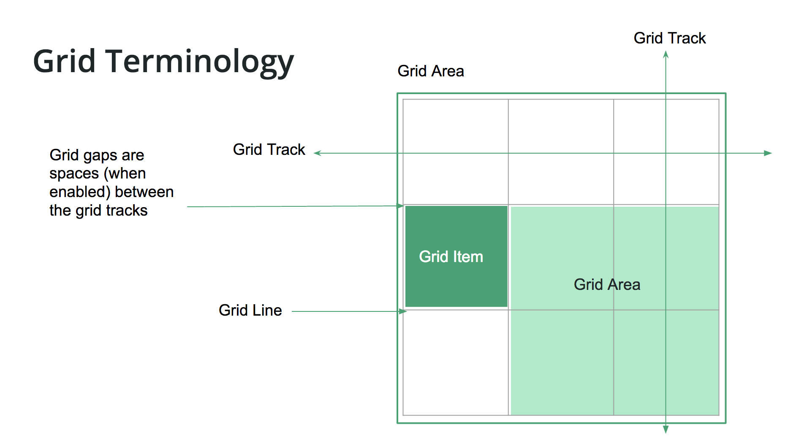
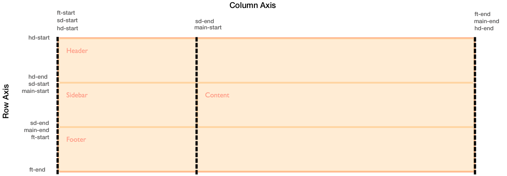

* TOC
{:toc}

Ein **Grid** besteht aus horizontalen und vertikalen **Grid-Linien.** Diese bilden ein Raster, an dem man andere Elemente ausrichten kann. Ein Grid hat **Spalten** (columns) und **Zeilen** (rows), die man **Tracks** nennt. Zwischen den einzelnen Tracks, also Zeilen und Spalten kann es einen Spalt  oder Abstand (**gap**) geben. Diesen bezeichnet man auch als "gutter".



Beim Anlegen eines Grids werden dessen Tracks angegeben, nicht dessen Linien. Die Linien "entstehen" sozusagen erst durch die Tracks. Ein normales 3-Spalten Grid hat also 4 vertikale Linien. Diese werden in Leserichtung durchnummeriert, also für LRT (1, 2, 3, 4), für RTL (4, 3, 2, 1).

Eine Grid-Zelle ist die kleinste Einheit auf einen Grid. Grid-Zellen ergeben sich automatisch aus dem Raster, das von den Grid-Linien aufgespannt wird.

Eine Grid-Area ist ein bestimmter Bereich eines Grids. Er kann eine oder mehrere Spalten und/oder Zeilen überspannen. Er muss jedoch immer rechteckig sein.

Grit-Items werden schließlich an Grid-Linien ausgerichtet. Beachte, dass in LTR (left to right) Sprachen die horizontale Linie 1 links ist, in RLT ist aber rechts.

Grids sind also etwas ähnlches wie Tabellen.

# Der Grid Container
Man kann einen Grid Container angelegen mit:
- `display: grid` oder
- `display: inline-grid`

Der Grid Container beinhaltet das Grid, also das Raster. Alle _direkten_ Kindelemente des Grid-Containers werden automatisch zu Grid-Items. Standardmäßig werden alle Grid-Items untereinander angezeigt.

```html
<div class="wrapper">
    <div>One</div>
    <div>Two</div>
    <div>Three</div>
    <div>Four</div>
    <div>Five</div>
</div>
```
```css
.wrapper {
    display: grid;
}
```

Ein **Grid-Track** ist eine bestimmte Spalte oder Zeile im Grid. Diese können wir explizit über zwei Eigenschaften definieren:
- `grid-template-columns` und
- `grid-template-rows`

Seit Grids gibt es eine neue Einheit in CSS: `fr`. In `fr` wird das Größenverhältnis von Spalten angegeben. Die Summe aller frs in einer Spalte oder Zeile dividiert durch ein einzelnes fr ergibt dessen Größenverhältnis.

```css
.wrapper {
    /* Fixe Breite */
    grid-template-columns: 200px 200px 200px;

    /* Drei gleich breite Spalten */
    grid-template-columns: 1fr 1fr 1fr;

    /* Eine 80px breite Zeile. Im Rest zwei Zeilen im Verhältnis 2:1 */
    grid-template-rows: 80px 2fr 1fr;

    /* repeat(#, x) spart Tipparbeit: 3 gleich breite Spalten */
    grid-template-columns: 80px, repeat(4, 1fr);
}
```

Mit grid-template-rows und -columns legen wir ein *explizites Grid* an. Reicht dies nicht aus, um alle Inhalte aufzunehmen, legt CSS automatisch ein implizites Grid an. Es fügt also dynamisch Spalten oder Zeilen hinzu. Das passiert auch, wenn wir etwas außerhalb des expliziten Grids positionieren.

Wir können das implizite Grid nur beeinflussen, indem wir ihm sagen, wie breit/hoch die einzelnen Spalten oder Zeilen sein sollen:
- `grid-auto-rows`
- `grid-auto-columns`

Dabei können wir mit der `minmax()`-Funktion eine Größe angeben, die nicht unter- bzw überschritten werden darf. Wir geben der Funktionen zwei Werte, die entweder eine Größenangabe sind, oder `auto`.

```css
.wrapper {
    /* Fixe Breite für implizite Grid-Zeilen */
    grid-auto-rows: 200px;

    /* Mindestens 100px und "so breit wie nötig" */
    grid-auto-rows: minmax(100px, auto);
}
```

# Grid Areas
Es gibt 4 CSS-Eigenschaften, mit denen man festlegen kann, in welcher Zeile und in welcher Spalte ein Grid-Item anfängt, und in welcher es aufhört. In einem solchen Fall spricht man von einer Grid-Area:
- `grid-column-start` und `grid-column-end`: Nummer der linken und rechten Linien.
- `grid-row-start` und `grid-row-end`: Nummer der oberen und unteren Linie
Alle Werte sind optional.

Um zwischen den Zeilen oder Spalten eines Grids einen Abstand (gutter) einzufügen, verwendet man zwei weitere Eigenschaften:
- `grid-column-gap: X` und `grid-row-gap: Y`
- `grid-gap: X Y` ist eine Kurzschreibweise sdafür

```css
.wrapper {
    display: grid;
    grid-template-columns: repeat(3, 1fr);
    grid-row-gap: 1em;
    grid-column-gap: 10px;

    /* Identisch zu den beiden Zeilen obendrüber */
    grid-gap: 1em 10px;
}

.box1 { 
    grid-row-start: 1;
    grid-row-end: 3;
    grid-column-start: 2;
    grid-column-end: 4;
}
```

Es ist möglich, dass sich in einem Grid bestimmte Items überlappen. Die Schichtung (layering) kann über den `z-index` gesteuert werden.

Außerdem kann es in einem Grid Zellen geben, die leer bleiben.

Desweiteren können Grids ineinander verschachtelt werden. Eine Zelle oder Area enthält dann ein eigenes, separates Grid.

Statt einer Liniennummer kann mit `span` auch angegeben werden, wie breit eine Area sein soll:
```css
.box1 {
    /* Identisch zu .box1 weiter oben */
    grid-column: 2;
    grid-row: 1 / span 2;
}
```

## Kurzschreibweisen
Zum definieren von Areas gibt es eine Kurzschreibweise:
```css
.box1 {
    /* Identisch zu .box1 weiter oben */
    grid-row: 1 / 3;    /* Von 1 bis 3 horizontal  */
    grid-column: 2 / 4; /* Von 2 bis 4 vertikal */
}

.box2 {
    grid-row: 3;    /* Von 3 bis zum "rechten" Ende */
    grid-column: 2; /* Von 2 bis zum unteren Ende */
}
```

Mit dem `grid-area`-Attribut kann man dies sogar noch kürzer schreiben. Außerdem kann mit negativen Werten vom Ende der Zeile/Spalte aus gezählt werden:

```css
.box1 {
    /* Identisch zu .box1 weiter oben */
    /* row-start / column-start / row-end / column-end */
    grid-area: 2 / 1 / 4 / 3;

    /* In einem 3x3 Grid ist dies identisch mit: */
    grid-area: -1 / -3 / -2 / -4;

    /* Auf diese Art kann man ein ELement ausdehnen */
    grid-column: 1 / -1;
}
```

## Namen für Linien
Wenn man mit grid-template-rows und grid-template-columns ein Grid anlegt, kann man dabei allen Linien Namen geben. Man schreibt diesen einfach in eckigen Klammern (braces) an die entsprechende Stelle in der Liste der Spalten oder Zeilen. Anschließend kann man statt den Liniennummern deren Namen verwenden.

Bei den Namen sollte man darauf achten, keine reservierten Wörter zu benutzen. (zB span)

Gibt man in einer Dimension nur einen Wert an, so wird "span 1" angenommen.

```css
.wrapper {
    display: grid;
    grid-template-columns: [main-start] 1fr   [content-start] 1fr   [content-end] 1fr   [main-end];
    grid-template-rows:    [main-start] 100px [content-start] 100px [content-end] 100px [main-end];
}

.box1 {
    grid-column-start: main-start;
    grid-row-start: main-start;
    grid-row-end: main-end;
}

.box3 {
    grid-column-start: content-start;
    grid-row-start: main-start;
}
```

Außerdem kann man einer Line auch mehrere Namen durch Leerzeichen getrennt geben. zB [sidebar-end main-start].

Wenn man Start- und Endlinie angebit und dann die Linie nach dem Schema NAME-start und NAME-end benennt, gibt CSS der erzeugten Grid-Area automatisch den Namen NAME.

Augehend vom vorangegangenen Beispiel lässt sich folgendermaßen ein Element in der Mitte des Grids anzeigen:

```css
<div class="wrapper">
    <div class="thing">中</div>
</div>

.thing {
    grid-area: content;
}
```


# Grid Template Areas
Ein praktisches Feature von Grid Areas ist, dass wir den einzelnen Areas Namen geben können, die wir von CSS aus ansprechen können.
- `grid-area: NAME`: verknüft eine Area des Grids mit einem Namen.

```css
.header  { grid-area: head; }
.footer  { grid-area: foot; }
.content { grid-area: main; }
.sidebar { grid-area: side; }

.wrapper {
    display: grid;
    grid-template-columns: 1fr;
    grid-template-areas: 
        "head"
        "main"
        "side"
        "foot";
}
@media (min-width: 500px) {
    .wrapper {
        grid-template-columns: repeat(4, 1fr);
        grid-auto-columns: minmax(150px, auto);
        grid-template-areas: 
            "head head head head"
            "main main main side"
            "foot foot foot side"
            " .    .    .   side";
    }
}
```

Genau wie Linien einer bestimmten Grid-Area einen Namen geben können, können Grid-Areas auch Linien Namen geben. So erzeugt eine Area namens AREA vier Namen: AREA-start und AREA-end jeweils in Richtung der Spalten und in Richtung der Zeilen.



## Kurzschreibweisen
Für Grid Templates gibt es zwei Kurzschreibweisen:
- `grid-template`: Explicit Grid Shorthand - setzt grid-template-rows, grid-template-columns und grid-template-areas.
- `grid`: Grid Definition Shorthand - setzt auch die Properties des Impliziten Grids. Es werden folgende Properties gesetzt: grid-template-rows, -columns und -areas sowie grid-auto-rows, -columns und -flow. Außerdem setzt es den grid-gap auf 0.

Die Syntax für beides kann man leicht am nächsten Beispiel sehen. Würde man hier statt grid-template die noch kürzere Schreibweise `grit` verwenden, würden alle nicht explizit gesetzen Eigenschaften auf ihren Standardwert gesetzt.

```css
.wrapper {
    display: grid;
    grid-template: /* oder: grid */
      "head head head head" minmax(100px, auto)
      "main main main main" minmax(100px, auto)
      "foot foot side side" minmax(100px, auto)
             / 1fr 1fr 1fr 1fr;           
}
```

Bei manchen Kurzschreibweisen ist zu berücksichtigen, dass sie die Lesbarkeit erschweren. Außerdem muss bedacht werden, dass mit einer Kurzschreibweise nicht nur mehrere Properties gesetzt werden können, sondern auch, dass die Properties, die in der Kurzschreibweise nicht gesetzt wurden oder werden können, auf ihren Standardwert zurückgesetzt werden.


<!-- TODO: https://developer.mozilla.org/en-US/docs/Web/CSS/CSS_Grid_Layout/Layout_using_Named_Grid_Lines#Multiple_lines_with_the_same_name_with_repeat() -->

# Auto Placement

<!-- TODO: https://developer.mozilla.org/en-US/docs/Web/CSS/CSS_Grid_Layout/Auto-placement_in_CSS_Grid_Layout -->
<!-- TODO: https://developer.mozilla.org/en-US/docs/Web/CSS/CSS_Grid_Layout/Box_Alignment_in_CSS_Grid_Layout -->
<!-- TODO: https://developer.mozilla.org/en-US/docs/Web/CSS/CSS_Grid_Layout/CSS_Grid,_Logical_Values_and_Writing_Modes -->
<!-- TODO: https://developer.mozilla.org/en-US/docs/Web/CSS/CSS_Grid_Layout/CSS_Grid_Layout_and_Accessibility -->
<!-- TODO: https://developer.mozilla.org/en-US/docs/Web/CSS/CSS_Grid_Layout/CSS_Grid_and_Progressive_Enhancement -->
<!-- TODO: https://developer.mozilla.org/en-US/docs/Web/CSS/CSS_Grid_Layout/Realizing_common_layouts_using_CSS_Grid_Layout -->


<!-- ### TODO: Grid und Flexbox
https://developer.mozilla.org/en-US/docs/Web/CSS/CSS_Grid_Layout/Relationship_of_Grid_Layout
Der Hauptunterschied zwischen Grid und Flexbox ist, dass Flexbox Elemente in einer Dimension anordnet währen ein Grid das in zwei Dimensionen tut. -->
