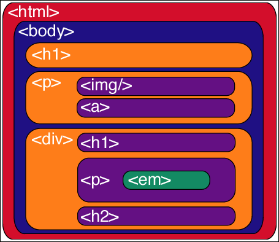

* TOC
{:toc}

# Was ist HTML
HTML (Hypertext Markup Language) ist **keine** Programmiersprache. Es ist eine Auszeichnungssprache, eine Sprache, die dazu dient, Dinge zu markieren (markup language). Sie dient dazu, dem Browser zu sagen, wie ein Dokument strukturiert ist. Welche Dokumententeile sind Überschriften, welche sind Absätze, Links, Zitate, Artikel, Abkürzungen, Uhrzeiten.

Ein HTML-Dokument besteht aus sogenannten Elementen, die verschiedene Teile der Seite umschließen und somit markieren. Der Browser stellt verschieden markierte Elemente meist verschieden dar. Mit Hilfe von CSS kann man diese Darstellung beeinflussen.

Wollen wir also, zum Beispiel, einen Textabschnitt als _Textabsatz_ markieren, so erreichen wir dies mit dem Paragraph-Element:
```html
<p>Mein Käse hat viele Löcher</p>
```

# Elemente & Attribute
* Elemente bestehen aus einem
  * öffnenden Tag
  * Inhalt
  * schließenden Tag (wie öffnendes, mit Schrägstrich)
  * `<p>Inhalt</p>`
* Elemente können Attribute besitzen, welche in das öffnende Tag geschrieben werden
* Attribute bestehen aus einem
  * Abstand zwischen Attribut und Elementnamen/vorherigen Attribut
  * Attributnamen, gefolgt von einem Gleichheitszeichen
  * Anführungs- und Schlusszeichen um den Wert (Wichtig!)
  * `<p class="toc">Inhalt</p>`
  * Es gibt auch boolsche Attribute, die auf zwei Arten geschrieben werden können:
    1. `<div hidden>`
    1. `<div hidden="hidden">`


# Verschachtelung & Baumstruktur
Ein Element kann andere Elemente beinhalten. Dies nennt man _Verschachtelung_ (nesting). Daraus ergibt sich eine Baumstruktur, die man sich auf verschiedene Arten vorstellen kann:

- Als auf den Kopf gestellten Baum mit einer Wurzel und vielen Blättern:


- Als übereinander geschichtete Flächen:



Beim Verschachteln ist immer darauf zu achten, das korrekt Verschachtelt wird. Bei falscher Verschachtelung fügt der Browser automatisch die fehlenden Tags ein, was meist unerwünschte Nebenwirkungen hat.

```html
<!-- OK -->
<p>Meine Schachtel schrie: <em>mach mich auf!</em></p>

<!-- Nicht OK -->
<p>Die Kiste schrie: <em>"Öffnen!"</p>, was ich komisch fand.</em>

<!-- Chrome macht zB das hier daraus: -->
<p>Die Kiste schrie: <em>"Öffnen!"</em></p><em>, was ich komisch fand.</em>
```

## Globale Attribute
Es gibt einige Attribute, die mit jedem HTML-Element verwendet werden können. Am weitaus häufigsten verwendet werden class und id:
```html
<p class="important">Invent new type of cheese.</p>
<table id="sales">...lots of HTML stuff here...<table>
```
Beachte, dass jede Id nur ein Mal in einem Dokument vorkommen darf (unique).


## [Block-Elemente](https://developer.mozilla.org/en-US/docs/Web/HTML/Block-level_elements)
* Machen die eigentliche Struktur des Dokuments aus:
  * Absätze, Listen, Navigationsmenüs, Fußzeile
* Erscheinen immer in einer neuen, eigenen Zeile.
* Der Inhalt von Block-Elementen nimmt immer 100% der Breite des Elternelements ein, ist jedoch nur so hoch wie sein Inhalt.
* Können nicht innerhalb von einem Inline-Element stehen
* Können andere Block-Elemente oder Inline-Elemente beinhalten
* Entspricht in HTML5 etwa dem "Flow Content"

## [Inline-Elemente](https://developer.mozilla.org/en-US/docs/Web/HTML/Inline_elements)
* Sind so breit und so hoch wie ihr Inhalt.
* Akzeptieren keine Angaben für Höhe und Breite.
* Stehen immer innerhalb eines Block-Elements
* Bilden keine neue Zeile, sondern erscheinen im normalen Textfluss, also _in line_.

Seit HTML5 gibt es noch eine weitere Möglichkeit, Elemente zu unterscheiden. Diese heißen [HTML5 Content Categories](https://developer.mozilla.org/en-US/docs/Web/Guide/HTML/Content_categories) und werden in der Dokumentation oft verwendet, um anzugeben, welche Art von Elementen ein anderes Element beinhalten kann.


# Grundgerüst
```html
<!DOCTYPE html>
<html>
  <head>
    <meta charset="utf-8">
    <title>Ameisendressurverein Hexapod</title>
  </head>
  <body>
    <p>Dieser Absatz hat keine Funktion, aber Text.</p>
  </body>
</html>
```
- `<!DOCTYPE html>` - sagte früher dem Browser, welche HTML Version verwendet wird und somit, welche Regeln er zu befolgen hat.
  - Früher sahen Doctypes zB so aus:
  ```html
  <!DOCTYPE HTML PUBLIC "-//W3C//DTD HTML 4.01//EN" "http://www.w3.org/TR/html4/strict.dtd">
  ```
  - Heute ist der Doctype eigentlich überflüssig, muss aber trotzdem ganz am Anfang jedes HTML Dokuments stehen.
- `<html>` umschließt das gesamte HTML Dokument. Das _root_-Element.
- `<head>` enthält Informationen _über_ das Dokument, die aber im Dokument selbst nicht angezeigt werden.
- `<body>` beinhaltet alles, was auf der Seite angezeigt werden soll. Sei es Text, Bilder oder Videos.
- `<meta charset="utf-8">` setzt das Character Encoding auf UTF-8, der heutzutage einzig sinnvolle Wert. (Früher: ISO-8859-1)
- `<title>` ist der Titel des Dokuments, der im Tab des Browsers angezeigt wird und auch für Bookmarks verwendet wird.


# Besonderheiten
* Jeglicher Whitespace wird immer auf ein einziges Leerzeichen komprimiert.
* Einige Sonderzeichen müssen "Escapet" werden, damit sie vom Browser nicht als Sonderzeichen sondern als normales Zeichen interpretiert werden. Dies sind: `&lt;` für <, `&amp;` für & und `&quot;` für "
* Kommentare werden in HTML mit `<!--` geöffnet und mit `-->` geschlossen. Sie dürfen _nicht_ verschachtelt werden.
* Es empfiehlt sich, im öffnenden `html`-Tag auch die Sprache der Seite anzugeben: `<html lang="de">`. Das lang-Attribut kann mit allen Elementen verwendet werden. Die Sprache wird dabei im [639-1](https://en.wikipedia.org/wiki/List_of_ISO_639-1_codes) Format angegeben.


# In your \<head>
Im head-Bereich des Dokuments können folgende Elemente vorkommen:
* `<title>` und `<meta charset="utf-8">`, wie oben beschrieben
* Das \<title\>-element darf nicht mit dem \<h1\>-Element verwechselt werden.

## \<meta\> Elemente

```html
<meta name="author" content="Virginia Woolf">
<meta name="description" content="One of the most interesting among the extremely boring authors of English Literary Modernism.">
<meta name="keywords" content="literature, author, english, modernism"
```

* Die "description" ist das, was von Google als Beschreibungstext indiziert wird und ist für SEO interessant. Diese Beschreibung wird bei den Suchergebnissen in der Googlesuche angezeigt. Der Text sollte nicht zu kurz sein, aber auch nicht länger als 300-350 Zeichen. Ob der Text wortwörtlich angezeigt wird oder nicht, liegt letztendlich im Ermessen des Google-Bots.
* Einen Author anzugeben kann ebenfalls sinnvoll sein
* Die Keywords können getrost weggelassen werden, da diese in der Zwischenzeit von fast keiner Suchmaschine mehr berücksichtigt werden.
* Es gibt noch viele weitere Metadaten, von denen viele proprietär sind, zB von Facebook oder Twitter.

## CSS und JavaScript
* CSS kann im head innerhalb eines `<style>`-Elements eingefügt werden.
* JavaScript kann im head innerhalb eines `<script>`-Elements eingefügt werden.
* Beides kann auch über eine externe Datei eingebunden werden.
* Scripte können nicht nur im head, sonder überall auf der Seite eingebunden werden. Aus technischen Gründen wird Javascript deshalb oft erst am Ende des body-Elements eingebunden.
* Es gibt auch sogenannte "inline styles", also CSS Regeln, die als Attribut eines HTML-Elements angegeben werden. `<p style="color: red">Blubb</p>` Ich zitiere MDN: "Please don't do this, unless you really have to!"

```html
<head>
    <style> a { color: blue; } </style>
    <script>alert("Script for a Jester's Tear")</script>

    <link rel="stylesheet" href="styles.css">
    <script src="scripts.js"></script>
</head>
```

# Dokument Flow
Der Dokumentenfluss oder Document Flow ist die Anordnung der Seitenelemente. Dieser wird durch die Reihenfolge der HTML Elemente im HTML Dokument bestimmt, kann jedoch mit CSS beinflusst werden.

Der normale Document Flow ist in der CSS Spezifikation festgelegt. Sie besagt, dass Elemente entsprechend ihrer Standard-Anzeigerolle (default display role) angezeigt werden. Block-Elemente nehmen die komplette Breite ein und ordnen sich eines unter dem anderen an. Inline-Elemente werden im normalen Textfluss ausgegeben.

Manche CSS Regeln können ein Element aus dem normalen Dokumentfluss "herauspflücken". 

Man kann sich den Dokumentenfluss vorstellen wie das Spiel _Tetris_ an einem Gameboy, der auf dem Kopf steht. Die Elemente fliegen von unten ins Dokument und fliegen so lange nach oben, bis sie an anderen Elementen anstoßen. Wenn ich eines der Elemente aus dem Tetris-Haus herausziehe, so rutschen alle anderen automatisch nach. In HTML gibt allerdings keine Extrapunkte für das pflücken größerer Elemente.


# Miniübung
Erstelle ein valides HTML Dokument mit folgenden Eigenschaften:
* Seitentitel: Don't lose your \<head\> by "Queen"
* Hauptüberschrift: "Könige & Königinnen"
* Textabsatz: Auf Chinesisch heißt König "王" (wáng), auf Türkisch "kral"
* Stelle Testweise den Zeichensatz auf "ISO-8859-1" um
* Binde ein externes Stylesheet ein und setze darin die Farbe der Überschrift auf grün.

