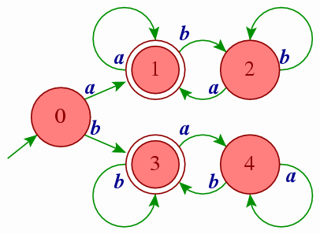

* TOC
{:toc}

## Was ist ein Regulärer Ausdruck
Ein regulärer Ausdruck (Abkürzung RegExp oder Regex) ist eine Zeichenkette, die der Beschreibung von Mengen von Zeichenketten mit Hilfe bestimmter syntaktischer Regeln dient. Es ist ein Ausdruck mit sogenannten Wildcards (Platzhaltern), der gegen einen String gesucht/gematcht wird.

Zu jedem regulären Ausdruck existiert ein endlicher Automat, der die vom Ausdruck spezifizierte Sprache akzeptiert. Man kann also jeden RegExp als Graphen aufzeichnen.




(der Pfeil von außerhalb gibt den Start an, die Knoten/Kreise mit weißem Ring sind mögliche Endzustände)

Der Automat im Schaubild matcht zum Beispiel alle Strings mit folgender Struktur:
- Der String muss entweder mit einem "a" oder einem "b" beginnen.
- Auf ein Zeichen können immer beliebig viele identische Zeichen folgen.
- Schreibt man nach einem "a" ein "b" oder nach einem "b" ein "a", so muss dieser "Wechsel" auch wieder rückwärts passieren. Es wird also immer eine gerade Anzahl von Welchseln durchgeführt.

Der Reguläre Ausdruck zu diesem Automaten wäre:
```javascript
regex = /(a(a*bb*a)*|b(b*aa*b)*)/
```

Typische Einsatzgebiete für Reguläre Ausdrücke wären die Überprüfung, ob ein angegebener Benutzername den Kriterien entspricht, nur Kleinbuchstaben, Zahlen, Unter- und Bindestriche zu beinhalten und zwischen 3 und 12 Zeichen lang zu sein.
```javascript
regex = /^[a-z0-9_-]{3,12}$/
```

## Einfache "Matcher"
Ein Regular Expression ist lediglich ein Muster aus Buchstaben und Zahlen, das wir in einem Text suchen.

Der RegExp `/the/` sucht nach einem "t", gefolgt von einem "h", gefolgt von einem "e".
```javascript
/the/.exec("The fat cat sat on the mat");
//=> ["the", index: 19, input: "The fat cat sat on the mat"]
```

Der RegExp wird Zeichen für Zeichen gegen den Eingabestring gematcht. Eines nach dem Anderen wird jedes Zeichen des RegExps mit jedem Zeichen des Eingabestrings verglichen.

Reguläre Ausdrücke sind im Normalfall case-sensitive.


## Meta Characters
Meta Characters sind die Bausteine von RegExps. Sie können nicht alleine Stehen, sondern haben im Kontext mit anderen Zeichen eine besondere Bedeutung.

| -------------- + ------------- |
| Meta Character | Beschreibung  |
|:--------------:|:--------------|
| .              | Ein beliebiges Zeichen, außer einem Zeilenumbruch (line break)
| [ ]            | Character class - Matcht jedes Zeichen, das in den Brackets aufgeführt ist
| [^ ]           | Negated character class - Matcht jedes Zeichen, das nicht in den Brackets aufgeführt ist
| *              | 0 oder mehr Wiederholungen des vorangegangenen Zeichens
| +              | 1 oder mehr Wiederholungen des vorangegangenen Zeichens
| ?              | 0 oder 1 Wiederholung des vorangegangenen Zeichens, macht dieses also optional
| {n,m}          | mindestens "n" und höchstens "m" Wiederholungen des vorangegangenen Zeichens
| (xyz)          | Character group - die Zeichen "xyz" in exakt dieser Reihenfolge
| \|             | Alteration - entweder die Zeichen vor oder nach dem Pipe-Symbol
| \              | Escapet das nächste Zeichen. Wird benötigt, um [ ] ( ) { } . * + ? ^ $ \ \| zu matchen
| ^              | Anfang der Zeile
| $              | Ende der Zeile
| \A             | Anfang des Strings
| \z             | Ende des Strings


### Punkt
Der Punkt (`.`) ist der einfachste Meta Character. Er matcht ein beliebiges einzelnes Zeichen, außer einem Zeilenumbruch.
```javascript
"The car parked in the garage.".match(/.ar/g);
//=> ["car", "par", "gar"]
```

### Zeichenklasse / Character class
Character classes beschreiben eine Menge von Zeichen, von denen ein beliebieges gematcht werden muss. Sie werden in eckigen Klammern angegeben. Mit einem Bindestrick kann ein Zeichenbereich angegeben werden, wie zB "a-f" für alle Kleinbuchstaben von a bis f.
```javascript
"The car parked in the garage.".match(/[Tt]he/g);
//=> ["The", "the"]
```

Ein Punkt in einer Character class stellt einen echten Punkt dar, nicht den Meta Character.

Der RegExp `/ar[.]/` bedeutet: ein "a" gefolgt von einem "r" gefolgt von einem Punkt ".".
```javascript
"A garage is a good place to park a car.".match(/ar[.]/g);
//=> ["ar."]
```

### Negierte Zeichenklasse
Normalerweise matcht das Caret "^" den Anfang des Strings. Als erstes Zeichen hinter der öffnenden Klammer einer Zeichenklasse negiert es jedoch diese Characterklasse.

Der RegExp [^c]ar bedeutet zum Beispiel: ein beliebiger Buchstabe außer "c", gefolgt von einem "a", gefolgt von einem "r".
```javascript
"The car parked in the garage.".match(/[^c]ar/g);
//=> ["par", "gar"]
```

### Wiederholungen
`+`, `*` und `?` werden verwendet, um anzugeben, wie oft sich ein Subpattern wiederholen darf.

#### Der Stern "*"
Das Symbol `*` matcht null oder mehr Wiederholungen des vorangegangenen Matchers.

Der RegExp `a*` matcht null oder mehr "a"s.

Nach einer Characterklasse bedeutet er, dass sich beliebige Zeichen der Klasse 0 oder mehr Male wiederholen müssen. 

`[a-z]*` bedeutet beliebig viele Kleinbuchstaben.
```javascript
"The car parked in the garage #21.".match(/[a-z]*/g);
//=> ["", "he", "", "car", "", "parked", "", "in", "", "the", "", "garage", "", "", "", "", "", ""]
```

Der Stern `*` kann mit dem Punkt `.` zusammen verwendet werden, um einen String von beliebigen Zeichen zu matchen. Er kann mit dem Whitespace Character `\s` verwendet werden, um eine beliebige Menge von Whitespace zu matchen.

So matcht zum Beispiel `\s*cat\s*` null oder mehr Whitespace-Zeichen, gefolgt von einem "c", einem "a" und einem "t", gefolgt von einer beliebeigen Menge Whitespace:
```javascript
"The fat cat sat on the concatenation.".match(/\s*cat\s*/g);
//=> [" cat ", "cat"]
```

#### Das Plus
Das Symbol `+` matcht eine oder mehr Wiederholungen des vorangegangenen Ziechens bzw. matchers.
`c.+t` bedeutet also, ein "c", geflogt von einer beliebigen Anzahl von Zeichen, gefolgt von einem "t".
```javascript
"The fat cat sat on the mat.".match(/c.+t/g);
//=> ["cat sat on the mat"]
```

#### Das Fragezeichen
Ein `?` macht den vorangegangenen Matcher optional. Es matcht also genau null oder eine Wiederholung. 

Der RegExp `[T]?he` bedeutet also, ein optionales "T" gefolgt von einem "h", gefolgt von einem 'e'.
```javascript
"The car is parked in the garage.".match(/[T]?he/g);
//=> ["The", "he"]
```

#### Braces / Geschweifte Klammern
Geschweifte Klammern werden verwendet, um anzugeben, wie oft ein Matcher wiederholt werden muss.

`[0-9]{2,3}` bedeutet mindestens 2 Zahlen und höchstens drei.
```javascript
"The number was 9.9997 but we rounded it off to 10.0.".match(/[0-9]{2,3}/g);
//=> ["999", "10"]
```

Lässt man die zweite Zahl weg, also `[0-9]{2,}`, werden zwei oder mehr Ziffern gematcht. Lassen wir auch das Komma weg, so wird die exakte Anzahl an Zeichen gematcht. `[0-9]{3}` matcht exakt 3 Ziffern.
```js
"[0-9]{2,}" => The number was 9.9997 but we rounded it off to 10.0.
//=> ["9997", "10"]0: "9997"1: "10"length: 2__proto__: Array[0]

"[0-9]{3}" => The number was 9.9997 but we rounded it off to 10.0.
//=> ["999"]
```

### Zeichengruppe / Character Group
Eine Zeichengruppe ist eine Gruppe von Subpatterns, die in runde Klammern geschrieben wird. Wir wissen, dass ein Quantifizierer nach einem Zeichen dieses Zeichen wiederholt. Ein Quantifizierer nach einer Zeichengruppe wiederholt jedoch die gesamte Gruppe.

`(ab)*` matcht null oder mehr Wiederholungen der Zeichen "ab".

In einer Zeichengruppe kann das Alternation Zeichen `|` verwendet werden:

`(c|g|p)ar` bedeutet ein "c", "g" or "p", gefolgt von einem "a", gefolgt von einem "r".
```javascript
"The car is parked in the garage.".match(/(c|g|p)ar/g);
//=> ["car", "par", "gar"]
```

### Alternation
Mit einem vertikalen Balken `|`, auch Pipe genannt, werden Alternativen für eine Zeichengruppe, einen Expression, angegeben. Dies unterscheidet sie von einer Character Class, die nur mit einzelnen Zeichen funktioniert.

`(T|t)he|car` matcht ein "T" oder "t", gefolgt von einem "h" und einem "e", oder ein "c" gefolgt von einem "a" und einem "r".
```javascript
"The car is parked in the garage.".match(/(T|t)he|car/g);
//=> ["The", "car", "the"]
```

### Sonderzeichen Escapen
In Regulären Ausdrücken wird der Backslash `\` verwendet, um das nächste Zeichen zu escapen. Er wird benötigt, um eines der Literale `{ } [ ] / \ + * . $ ^ | ?` zu matchen. Um also einen literalen "." in einem String zu suchen, muss man "\." schreiben.

Der RegExp `(f|c|m)at\.?` bedeutet also, ein "f", ein "c", oder ein "m", gefolgt von einem "a" und einem "t", gefolgt von einem optionalen Punkt.
```javascript
"The fat cat sat on the mat.".match(/(f|c|m)at\.?/g);
//=> ["fat", "cat", "mat."]
```

### Anker / Anchors
Mit Ankern kann man den Anfang oder das Ende einer Zeile matchen. Das Caret `^` matcht dabei den Anfang der Zeile, während ein `$` das Ende der Zeile matcht. Will man über Zeilenumbrüche hinweg matchen, muss statt dem Caret `\A` verwendet werden und statt dem Dollar `\z`.

`^(T|t)he` matcht ein "T" oder "t" am Anfang der Zeile, gefolgt von einem "h" und einem "e".
```javascript
"The car is parked in the garage.".match(/^(T|t)he/g);
//=> ["The"]
```

`(at\.)$` sucht ein "a" gefolgt von einem "t", gefolgt von einem ".", der auch das letzte Zeichen der Zeile sein muss.
```javascript
"The fat cat. sat. on the mat.".match(/(at\.)$/g);
//=> ["at."]
```

### Abkürzungen für Characterklassen

| --------- + ----------- |
| Shorthand | Description |
|:---------:|:----------- |
| .	        | Beliebiges Zeichen außer Newline
| \w        | Alphanumerische Zeichen: [a-zA-Z0-9_]
| \W        | Nicht-alphanumerische Zeichen: [^\w]
| \d        | Ziffern: [0-9]
| \D        | alles außer Ziffern: [^\d]
| \s        | Whitespace Zeichen: [\t\n\f\r\p{Z}]
| \S        | non-Whitespace Zeichen: [^\s]
| \b        | Worttrennzeichen, word boundary, Wechsel von \w zu \W oder \W zu \w

<!-- TODO 4. Lookaround

Lookbehind and lookahead sometimes known as lookaround are specific type of non-capturing group (Use to match the pattern but not included in matching list). Lookaheads are used when we have the condition that this pattern is preceded or followed by another certain pattern. For example, we want to get all numbers that are preceded by $ character from the following input string $4.44 and $10.88. We will use following regular expression (?<=\$)[0-9\.]* which means: get all the numbers which contain . character and are preceded by $ character. Following are the lookarounds that are used in regular expressions:

Symbol	Description
?=	Positive Lookahead
?!	Negative Lookahead
?<=	Positive Lookbehind
?<!	Negative Lookbehind
4.1 Positive Lookahead

The positive lookahead asserts that the first part of the expression must be followed by the lookahead expression. The returned match only contains the text that is matched by the first part of the expression. To define a positive lookahead, parentheses are used. Within those parentheses, a question mark with equal sign is used like this: (?=...). Lookahead expression is written after the equal sign inside parentheses. For example, the regular expression [T|t]he(?=\sfat) means: optionally match lowercase letter t or uppercase letter T, followed by letter h, followed by letter e. In parentheses we define positive lookahead which tells regular expression engine to match The or the which are followed by the word fat.

"[T|t]he(?=\sfat)" => The fat cat sat on the mat.
Test the regular expression

4.2 Negative Lookahead

Negative lookahead is used when we need to get all matches from input string that are not followed by a pattern. Negative lookahead defined same as we define positive lookahead but the only difference is instead of equal = character we use negation ! character i.e. (?!...). Let's take a look at the following regular expression [T|t]he(?!\sfat) which means: get all The or the words from input string that are not followed by the word fat precedes by a space character.

"[T|t]he(?!\sfat)" => The fat cat sat on the mat.
Test the regular expression

4.3 Positive Lookbehind

Positive lookbehind is used to get all the matches that are preceded by a specific pattern. Positive lookbehind is denoted by (?<=...). For example, the regular expression (?<=[T|t]he\s)(fat|mat) means: get all fat or mat words from input string that are after the word The or the.

"(?<=[T|t]he\s)(fat|mat)" => The fat cat sat on the mat.
Test the regular expression

4.4 Negative Lookbehind

Negative lookbehind is used to get all the matches that are not preceded by a specific pattern. Negative lookbehind is denoted by (?<!...). For example, the regular expression (?<!(T|t)he\s)(cat) means: get all cat words from input string that are not after the word The or the.

"(?<![T|t]he\s)(cat)" => The cat sat on cat.
Test the regular expression -->

## Flags
Flags, auch Modifikatoren genannt, beeinflussen die Funktionsweise eines Regular Expressions. Flags können in beliebiger Reihenfolge angegeben und miteinander kombiniert werden.

| ---- + ----------- |
| Flag | Description |
|:----:|:------------|
| i    | Case insensitive matching - nicht zwischen Groß- und Kleinbuchstaben unterscheiden
| g    | Global Search - alle Matches im gesamten String suchen - normalerweise wird nach dem ersten Treffer abgebrochen
| m    | Multiline - Behandelt den String als mehrzeiligen String. Caret und Dollar matchen nun am Anfang/Ende jeder Zeile.


```javascript
"The fat cat sat on the mat.".match(/The/gi);
//=> ["The", "the"]

"The fat cat\n sat on the mat.".match(/.(at)/);
//=> ["fat", "at"]

"The fat cat sat on the mat.".match(/.(at)/g);
//=> ["fat", "cat", "sat", "mat"]

"The fat\ncat sat\non the mat.".match(/.at(.)?$/);
//=> ["mat.", "."]

"The fat\ncat sat\non the mat.".match(/.at(.)?$/gm);
//=> ["fat", "sat", "mat."]
```
